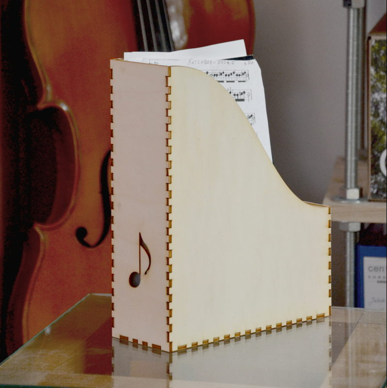

# Notenbox – Lasercutter Vorlage für eine Notenbox fürs Regal

für 4mm Sperrholz

Entstehung:
* Box erstellt mit http://www.makercase.com/
* mit Inkscape die Pfade angepasst (Note als .svg von wikimedia: https://commons.wikimedia.org/wiki/File:Parts_of_a_musical_note.svg)
* ausgedruckt (power = 100%; speed = 6%; ppi = 1000; z-axis: 4mm)
* geklebt
